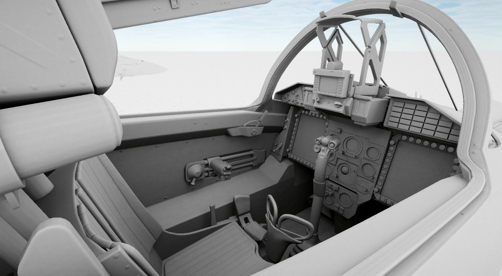
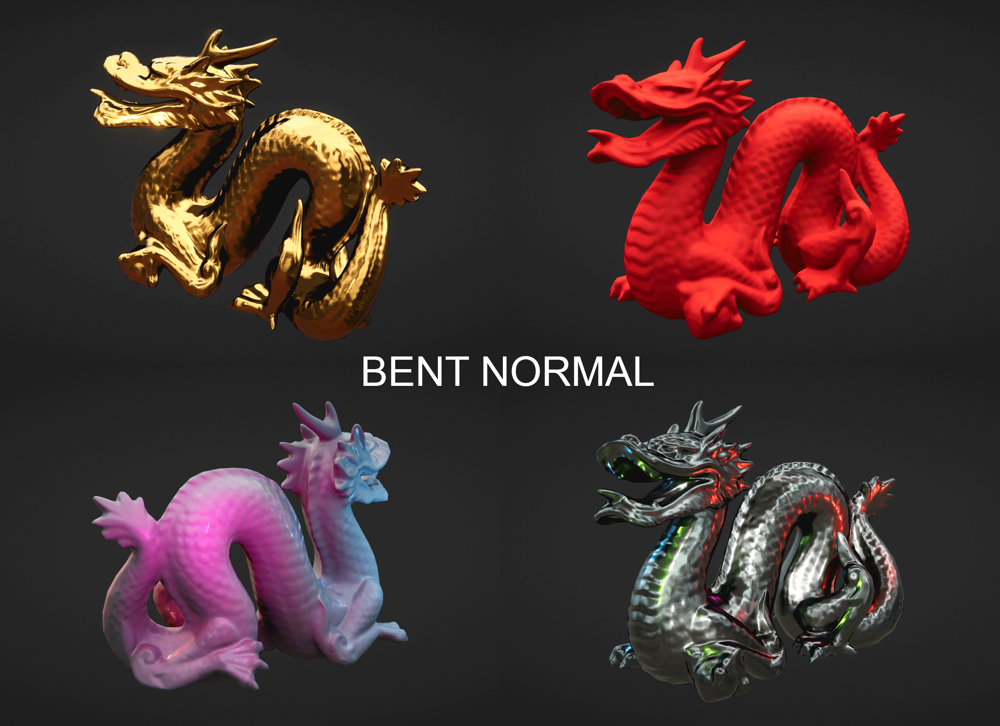

# Baker Boy

# [--> Demo Executable <--](http://fewes.se/downloads/BakerBoyDemo.zip)

# What is this?
A tiny GPU-based ambient occlusion and bent normal baker for Unity. It is the successor to my [BNAO repository](https://github.com/Fewes/BNAO). In comparison it has a lighter feature set but outputs cleaner/more consistent results and should work in any render pipeline.

# How do I use it?
Place the BakerBoy script on the root GameObject of the objects you would like to bake and press Find Renderers. Use the UI to manage which renderers should be part of the bake and press the Bake button. All settings live inside a BakerBoyConfig scriptable object.

# What are bent normals?
Bent normal maps store the direction of least occlusion (in other words, the direction in which the most ambient light is coming from) in a texture.  
They can be used to occlude cubemap reflections based on the view direction in a much more realistic way than just multiplying with an ambient occlusion term. They can also be used to attenuate light sources without shadows, and to get an ambient color value which more closesly resembles a ray traced result.
For a visual example, check the demo executable linked at the top.
For details on how to implement these effects in your own shader, check the function GetReflectionOcclusion in the file BakerBoyLighting.hlsl

# Features
* Supports baking ambient occlusion or bent normal maps from low-poly geometry, right in the editor.
* Supports baking with alpha-tested materials.
* Simple UI for managing which renderers are baked, included in occlusion testing or skipped entirely. Automatically groups output textures based on which materials are found.
* Automatically uses normal maps present in original materials for a higher quality result.
